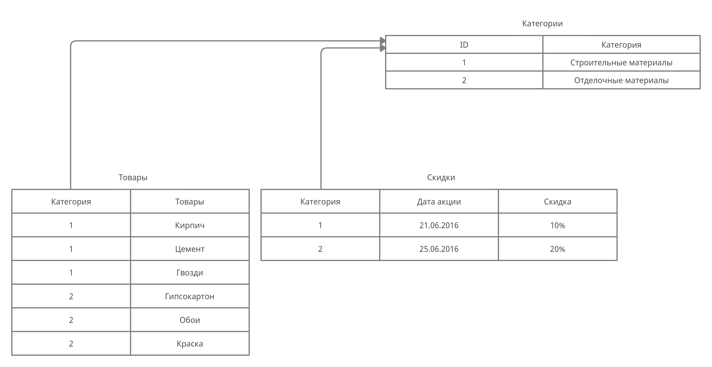

# Нормализация БД

Процесс проектирования БД с использование метода НФ является итерационным и заключается в последовательном переводе отношения из 1НФ в НФ более высокого порядка по определенным правилам. Каждая следующая НФ ограничивается определенным типом функциональных зависимостей и устранением соответствующих аномалий при выполнении операций над отношениями БД, а также сохранении свойств предшествующих НФ.

## Первая нормальная форма (1НФ)

> Переменная отношения находится в первой нормальной форме, когда в любом допустимом значении отношения каждый его кортеж содержит только одно значение для каждого из атрибутов.

### Пример приведения к первой нормальной форме

| Категория              | Товары                    |
| :---                   | :---                      |
| Строительные материалы | Кирпич, цемент, гвозди    |
| Отделочные материалы   | Гипсокартон, обои, краска |

В ячейке "Товары" данные присутствуют не в атомарном виде, приведем данные к первой нормальной форме.

| Категория              | Товары      |
| :---                   | :---        |
| Строительные материалы | Кирпич      |
| Строительные материалы | Цемент      |
| Строительные материалы | Гвозди      |
| Отделочные материалы   | Гипсокартон |
| Отделочные материалы   | Обои        |
| Отделочные материалы   | Краска      |

## Вторая нормальная форма (2НФ)

> Переменная отношения находится во второй нормальной форме, когда она находится в первой нормальной форме, и каждый не ключевой атрибут неприводимо (функционально полно) зависит от её потенциального ключа.

### Пример приведения ко второй нормальной форме

| Категория              | Дата акции | Скидка | Товары      |
| :---                   | :---       | :---   | :---        |
| Строительные материалы | 21.06.2016 | 10%    | Кирпич      |
| Строительные материалы | 21.06.2016 | 10%    | Цемент      |
| Строительные материалы | 21.06.2016 | 10%    | Гвозди      |
| Отделочные материалы   | 25.06.2016 | 20%    | Гипсокартон |
| Отделочные материалы   | 25.06.2016 | 20%    | Обои        |
| Отделочные материалы   | 25.06.2016 | 20%    | Краска      |

В этой таблице первичные ключи представлены в виде двух столбцов – категория и дата акции. Схема функционально зависит от категории и не зависит от даты – т. е. зависимость от первичного ключа проявляется частично. Приведем таблицу ко второй нормальной форме.

| Категория              | Дата акции | Скидка |
| :---                   | :---       | :---   |
| Строительные материалы | 21.06.2016 | 10%    |
| Отделочные материалы   | 25.06.2016 | 20%    |

| Категория              | Товары      |
| :---                   | :---        |
| Строительные материалы | Кирпич      |
| Строительные материалы | Цемент      |
| Строительные материалы | Гвозди      |
| Отделочные материалы   | Гипсокартон |
| Отделочные материалы   | Обои        |
| Отделочные материалы   | Краска      |

## Третья нормальная форма (3НФ)

> Переменная отношения находится в третьей нормальной форме тогда и только тогда, когда она находится во второй нормальной форме, и отсутствуют транзитивные функциональные зависимости не ключевых атрибутов от ключевых.

### Пример приведения к третьей нормальной форме

Привести к третьей нормальной форме – это значит выделить из таблицы первичный ключ, который будет уникально идентифицировать запись в таблице.

| ID   | Категория              | 
| :--- | :---                   |
| 1    | Строительные материалы |
| 2    | Отделочные материалы   |

| Категория | Дата акции | Скидка |
| :---      | :---       | :---   |
| 1         | 21.06.2016 | 10%    |
| 2         | 25.06.2016 | 20%    |

| Категория | Товары      |
| :---      | :---        |
| 1         | Кирпич      |
| 1         | Цемент      |
| 1         | Гвозди      |
| 2         | Гипсокартон |
| 2         | Обои        |
| 2         | Краска      |

Визуализация отношений БД находящейся в 3НФ

## Нормальная форма Бойса-Кодда

> Переменная отношения находится в нормальной форме Бойса-Кодда (иначе – в усиленной третьей нормальной форме), когда каждая её нетривиальная и неприводимая слева функциональная зависимость имеет в качестве своего детерминанта некоторый потенциальный ключ.
> 
> Другими словами, в таблице должен быть только один первичный ключ.

## Четвёртая нормальная форма (4НФ)

> Переменная отношения находится в четвертой нормальной форме, если она находится в нормальной форме Бойса-Кодда и не содержит нетривиальных многозначных зависимостей.
> 
> Предположим, что рестораны производят разные виды пиццы, а службы доставки ресторанов работают только в определенных районах города. Составной первичный ключ соответствующей переменной отношения включает три атрибута:
> 
> { Ресторан, Вид пиццы, Район доставки }.
> 
>Такая переменная отношения не соответствует 4НФ, так как существует следующая многозначная зависимость:
> 
> { Ресторан } → { Вид пиццы }
> 
> { Ресторан } → { Район доставки }
> 
> То есть, например, при добавлении нового вида пиццы придется внести по одному новому кортежу для каждого района доставки. Возможна логическая аномалия, при которой определенному виду пиццы будут соответствовать лишь некоторые районы доставки из обслуживаемых рестораном районов.
> 
> Для предотвращения аномалии нужно декомпозировать отношение, разместив независимые факты в разных отношениях. В данном примере следует выполнить декомпозицию на
> 
> { Ресторан, Вид пиццы } и { Ресторан, Район доставки }.
> 
> Однако, если к исходной переменной отношения добавить атрибут, функционально зависящий от потенциального ключа, например, цену с учётом стоимости доставки ({ Ресторан, Вид пиццы, Район доставки } → Цена), полученное отношение будет находиться в 4НФ и его уже нельзя подвергнуть декомпозиции без потерь.

## Пятая нормальная форма (5НФ)

> Переменная отношения находится в пятой нормальной форме (иначе – в проекционно-соединительной нормальной форме), когда каждая нетривиальная зависимость соединения в ней определяется потенциальным ключом (ключами) этого отношения.
> 
> Другими словами, если есть сложная связь между зависимыми атрибутами, она должна выноситься в отдельную таблицу. Не нужно делать зависимость трех и более атрибутов. На практике такое встречается очень редко, но придерживаться данного правила необходимо.

## Доменно-ключевая нормальная форма

> Переменная отношения находится в ДКНФ, когда каждое наложенное на неё ограничение является логическим следствием ограничений доменов и ограничений ключей, наложенных на данную переменную отношения.

## Шестая нормальная форма (6НФ)

> Переменная отношения находится в шестой нормальной форме, когда она удовлетворяет всем нетривиальным зависимостям соединения.
> 
> Из определения следует, что переменная находится в 6НФ, когда она неприводима, то есть не может быть подвергнута дальнейшей декомпозиции без потерь. Каждая переменная отношения, которая находится в 6НФ, также находится и в 5НФ.

### Из всех представленных форм практическое применение обычно имеют первые четыре НФ.

# Типы данных в MySQL

### TINYINT[(M)] [UNSIGNED] [ZEROFILL]

> Очень малое целое число. Диапазон со знаком от -128 до 127. Диапазон без знака от 0 до 255.

### BIT, BOOL

> Являются синонимами для TINYINT(1).

### SMALLINT[(M)] [UNSIGNED] [ZEROFILL]

> Малое целое число. Диапазон со знаком от -32768 до 32767. Диапазон без знака от 0 до 65535.

### MEDIUMINT[(M)] [UNSIGNED] [ZEROFILL]

> Целое число среднего размера. Диапазон со знаком от -8388608 до 8388607. Диапазон без знака от 0 до 16777215.

### INT[(M)] [UNSIGNED] [ZEROFILL]

> Целое число нормального размера. Диапазон со знаком от -2147483648 до 2147483647. Диапазон без знака от 0 до 4294967295.

### INTEGER[(M)] [UNSIGNED] [ZEROFILL]

> Синоним для INT.

### BIGINT[(M)] [UNSIGNED] [ZEROFILL]

> Большое целое число. Диапазон со знаком от -9223372036854775808 до 9223372036854775807. Диапазон без знака от 0 до 18446744073709551615. Для столбцов типа BIGINT необходимо учитывать некоторые особенности:
> 
> Все арифметические операции выполняются с использованием значений BIGINT или DOUBLE со знаком, так что не следует использовать беззнаковые целые числа больше чем 9223372036854775807 (63 бита), кроме операций, выполняемых логическими функциями. В противном случае несколько последних разрядов результата могут оказаться неверными из-за ошибок округления при преобразовании BIGINT в DOUBLE. MySQL 4.0 может обрабатывать данные типа BIGINT в следующих случаях:
> 
> Использование целых чисел для хранения больших беззнаковых величин в столбце с типом BIGINT.
> 
> В случаях MIN(big_int_column) и MAX(big_int_column).
> 
> При использовании операторов («+» , «-», «*» и т.д.), когда оба операнда являются целыми числами.
> 
> Точное значение целого числа всегда можно хранить в столбце с типом BIGINT в виде строки. В этом случае MySQL выполнит преобразование строки в число без промежуточного преобразования.
> 
> Если оба аргумента являются целочисленными величинами, при выполнении над ними операций «+» , «-» и «*» будут использоваться правила BIGINT-арифметики. Это означает, что при умножении двух больших целых чисел (или результатов вычислений функций, возвращающих целые числа) результат операции может оказаться непредсказуемым, если он превосходит значение 9223372036854775807.

### FLOAT (точность) [UNSIGNED] [ZEROFILL]

> Число с плавающей точкой. Атрибут точности может иметь значение <=24 для числа с плавающей точкой обычной (одинарной) точности и между 25 и 53 – для числа с плавающей точкой удвоенной точности. Эти типы данных сходны с типами FLOAT и DOUBLE, описанными ниже. FLOAT(X) относится к тому же интервалу, что и соответствующие типы FLOAT и DOUBLE, но диапазон значений и количество десятичных знаков не определены.
> 
> В версии MySQL 3.23 это истинная величина числа с плавающей точкой. В более ранних версиях MySQL тип данных FLOAT(точность) всегда имеет два десятичных знака.
> 
> Следует отметить, что использование типа данных FLOAT может привести к неожиданным проблемам, так как все вычисления в MySQL выполняются с удвоенной точностью.

### FLOAT[(M,D)] [UNSIGNED] [ZEROFILL]

> Малое число с плавающей точкой обычной точности. Допустимые значения: от -3,402823466E+38 до -1,175494351E-38, 0, и от 1,175494351E-38 до 3,402823466E+38. Если указан атрибут UNSIGNED, отрицательные значения недопустимы. Атрибут M указывает количество выводимых пользователю знаков, а атрибут D – количество разрядов, следующих за десятичной точкой. Обозначение FLOAT без указания аргументов или запись вида FLOAT(X), где X <=24 справедливы для числа с плавающей точкой обычной точности.

### DOUBLE[(M,D)] [UNSIGNED] [ZEROFILL]

> Число с плавающей точкой удвоенной точности нормального размера. Допустимые значения: от -1,7976931348623157E+308 до -2,2250738585072014E-308, 0, и от 2,2250738585072014E-308 до 1,7976931348623157E+308. Если указан атрибут UNSIGNED, отрицательные значения недопустимы. Атрибут M указывает количество выводимых пользователю знаков, а атрибут D – количество разрядов, следующих за десятичной точкой. Обозначение DOUBLE без указания аргументов или запись вида FLOAT(X), где 25 <= X <= 53 справедливы для числа с плавающей точкой двойной точности.

### DOUBLE PRECISION[(M,D)] [UNSIGNED] [ZEROFILL] , REAL[(M,D)] [UNSIGNED] [ZEROFILL]

> Данные обозначения являются синонимами для DOUBLE.

### DECIMAL[(M[,D])] [UNSIGNED] [ZEROFILL]

> «Неупакованное» число с плавающей точкой. Ведет себя подобно столбцу CHAR, содержащему цифровое значение. Термин «неупакованное» означает, что число хранится в виде строки, и при этом для каждого десятичного знака используется один символ. Разделительный знак десятичных разрядов, а также знак «-» для отрицательных чисел, не учитываются в M (но место для них зарезервировано). Если атрибут D равен 0, величины будут представлены без десятичного знака, т. е. без дробной части. Максимальный интервал значений типа DECIMAL тот же, что и для типа DOUBLE, но действительный интервал для конкретного столбца DECIMAL может быть ограничен выбором значений атрибутов M и D. Если указан атрибут UNSIGNED, отрицательные значения недопустимы. Если атрибут D не указан, его значение по умолчанию равно 0. Если не указан M, его значение по умолчанию равно 10. В более ранних, чем MySQL 3.23, версиях аргумент M должен содержать в себе место для знака числа и десятичного знака.

### DEC[(M[,D])] [UNSIGNED] [ZEROFILL] , NUMERIC[(M[,D])] [UNSIGNED] [ZEROFILL]

> Данные обозначения являются синонимами для DECIMAL.

### DATE

> Дата. Поддерживается интервал от '1000-01-01' до '9999-12-31'. MySQL выводит значения DATE в формате 'YYYY-MM-DD', но можно установить значения в столбец DATE, используя как строки, так и числа.

### DATETIME

> Комбинация даты и времени. Поддерживается интервал от '1000-01-01 00:00:00' до '9999-12-31 23:59:59'. MySQL выводит значения DATETIME в формате 'YYYY-MM-DD HH:MM:SS', но можно устанавливать значения в столбце DATETIME, используя как строки, так и числа.

### TIMESTAMP[(M)]

> Временная метка. Интервал от '1970-01-01 00:00:00' до некоторого значения времени в 2037 году. MySQL выводит значения TIMESTAMP в форматах YYYYMMDDHHMMSS, YYMMDDHHMMSS, YYYYMMDD или YYMMDD в зависимости от значений M: 14 (или отсутствующее), 12, 8, или 6; но можно также устанавливать значения в столбце TIMESTAMP, используя как строки, так и числа.
> 
> Столбец TIMESTAMP полезен для записи даты и времени при выполнении операций INSERT или UPDATE, так как при этом автоматически вносятся значения даты и времени самой последней операции, если эти величины не введены программой. Можно также устанавливать текущее значение даты и времени, задавая значение NULL. Аргумент M влияет только на способ вывода столбца TIMESTAMP; для хранения его значений всегда используется 4 байта. Следует учитывать, что столбцы TIMESTAMP(M), где M равно 8 или 14, представляют собой числа, в то время, как столбцы TIMESTAMP(M) с иным значением аргумента M являются строками. Это убеждает, что можно надежно сделать дамп и восстановить таблицу с этими типами столбцов!

### TIME

> Время. Интервал от '-838:59:59' до '838:59:59'. MySQL выводит значения TIME в формате 'HH:MM:SS', но можно устанавливать значения в столбце TIME, используя как строки, так и числа.

### YEAR[(2|4)]

> Год в двухзначном или четырехзначном форматах (по умолчанию формат четырехзначный). Допустимы следующие значения: с 1901 по 2155, 0000 для четырехзначного формата года и 1970-2069 при использовании двухзначного формата (70-69). MySQL выводит значения YEAR в формате YYYY, но можно задавать значения в столбце YEAR, используя как строки, так и числа (тип данных YEAR недоступен в версиях, предшествующих MySQL 3.22).

### [NATIONAL] CHAR(M) [BINARY]

> Строка фиксированной длины, при хранении всегда дополняется пробелами в конце строки до заданного размера. Диапазон аргумента M составляет от 0 до 255 символов (от 1 до 255 в версиях, предшествующих MySQL 3.23). Концевые пробелы удаляются при выводе значения. Если не задан атрибут чувствительности к регистру BINARY, величины CHAR сортируются и сравниваются как независимые от регистра в соответствии с установленным по умолчанию алфавитом.
> 
> Атрибут NATIONAL CHAR (или его эквивалентная краткая форма NCHAR) представляет собой принятый в ANSI SQL способ указания, что в столбце CHAR должен использоваться установленный по умолчанию набор символов (CHARACTER). В MySQL это принято по умолчанию. CHAR является сокращением от CHARACTER. MySQL позволяет создавать столбец типа CHAR(0).
> 
> В основном это полезно, если необходимо обеспечить совместимость с некоторыми старыми приложениями, которые зависят от наличия столбца, но реально эту величину не используют. Кроме того, такая возможность может очень пригодиться в случае, если необходим столбец, который может содержать только 2 значения, а именно CHAR(0) (т.е. столбец, который не определен как NOT NULL, занимает только один бит и принимает только 2 значения: NULL или «»).

### CHAR

> Это синоним для CHAR(1).

### [NATIONAL] VARCHAR(M) [BINARY]

> Строка переменной длины. Примечание: концевые пробелы удаляются при сохранении значения (в этом заключается отличие от спецификации ANSI SQL). Диапазон аргумента M составляет от 0 до 255 символов (от 1 до 255 в версиях, предшествующих MySQL Version 4.0.2). Если не задан атрибут чувствительности к регистру BINARY, величины VARCHAR сортируются и сравниваются как независимые от регистра.

### TINYBLOB, TINYTEXT

> Столбец типа BLOB или TEXT с максимальной длиной 255 (2^8 - 1) символов.

### BLOB, TEXT

> Столбец типа BLOB или TEXT с максимальной длиной 65535 (2^16-1).

### MEDIUMBLOB, MEDIUMTEXT

> Столбец типа BLOB или TEXT с максимальной длиной 16777215 (2^24-1).

### LONGBLOB, LONGTEXT

> Столбец типа BLOB или TEXT с максимальной длиной 4294967295 (2^32-1) символов. Следует учитывать, что в настоящее время протокол передачи данных сервер/клиент и таблицы MyISAM имеют ограничение 16 Мб на передаваемый пакет/строку таблицы, поэтому пока нельзя использовать этот тип данных в его полном диапазоне.

### ENUM('значение1', 'значение2', ...)

> Перечисление. Перечисляемый тип данных. Объект строки может иметь только одно значение, выбранное из заданного списка величин 'значение1', 'значение2', ..., NULL или специальная величина ошибки «». Список ENUM может содержать максимум 65535 различных величин.

### SET('значение1' ,'значение2', ...)

> Набор. Объект строки может иметь ноль или более значений, каждое из которых должно быть выбрано из заданного списка величин 'значение1', 'значение2', ... Список SET может содержать максимум 64 элемента.

На практике чаще всего используются INT, FLOAT, VARCHAR, TEXT, DATETIME, TIMESTAMP. Этими типами данных можно описать любую таблицу. Но знание и понимание типов данных необходимо, потому что встречаются задачи, где их использование необходимо.

# Ключи

## Первичный ключ

В РСУБД существует несколько видов ключей. Самый главный – первичный. Он уникально идентифицирует строку данных, без него приведение к 4НФ было бы невозможно.

Первичный ключ обладает следующими свойствами:

- Уникальность
- Долговечность
- Минимальность

Первичный ключ может быть простым или составным. Если первичный ключ состоит из нескольких атрибутов, он является составным.

## Уникальный ключ

Уникальный ключ обладает всеми свойствами первичного, но первичным не является. Используется для уникальных атрибутов (например, номер банковского счета, email-адрес).

## Внешний ключ

Внешний ключ является ключом – ссылкой, связью между таблицами. Внешние ключи используются для проверки РСУБД на целостность. Если атрибут, на который указывает внешний ключ, не будет присутствовать в таблице, на которую он указывает, это приведет к ошибке.